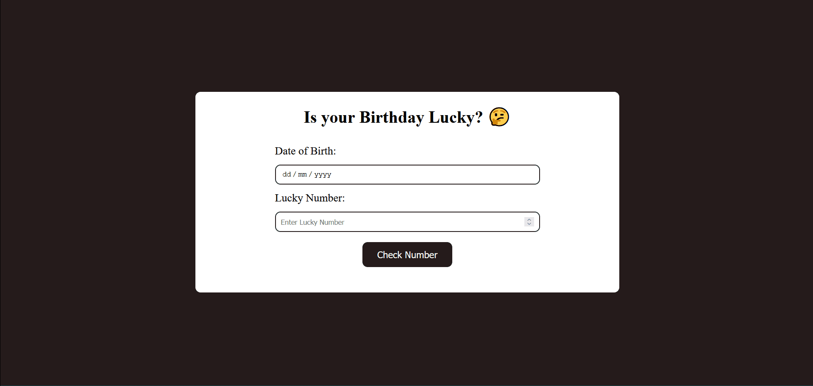

# neoG Camp - Is Your Birthday Lucky?

The user need to enter their birth date and a lucky number, this app will tell them if that number is lucky for them or not.

## Table of contents

- [Overview](#overview)
  - [Screenshot](#screenshot)
  - [Links](#links)
- [My process](#my-process)
  - [Built with](#built-with)
  - [What I learned](#what-i-learned)
- [Author](#author)

## Overview

### Screenshot

### Links

- [View live](https://lucky-number-app.netlify.app/)

## My process

### Built with

- Semantic HTML5 markup
- [Sass](https://sass-lang.com/) - CSS extension language
- CSS Flexbox
- Vanilla JavaScript

### What I learned

In this project, I worked with string methods such as `split()` and `replaceAll` also with array `reduce()` method to reduce the array into one value.

## Author

- Twitter - [@junaidshaikh_js](https://twitter.com/junaidshaikh_js)
- Linkedin - [@junaidshaikhjs](https://www.linkedin.com/in/junaidshaikhjs/)
